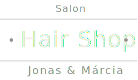
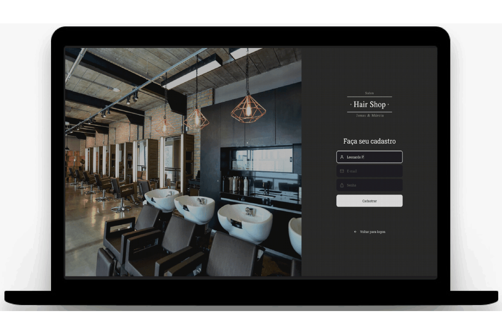
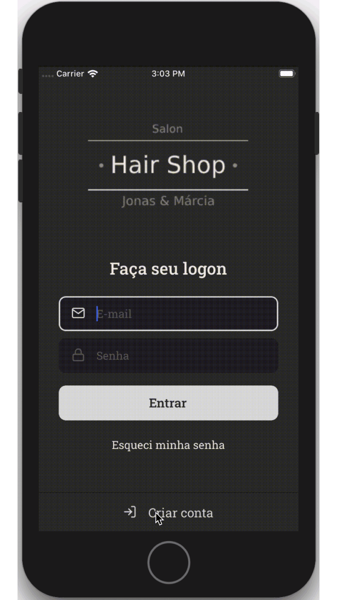

<h1 align="center">
  
</h1>

<h3 align="center">
🚧 In Development 🚧 <br>
Project being built along with Rocketseat's GoStack - <a href="https://rocketseat.com.br/">RocketSeat</a>
</h3>

<p align="center">
  
  
  

  
  
  

  <br>

  

  

  

  
</p>

<br>

### 📝 About the project
Hair Shop is an application for hairdressing salon, where hairdressers can register on the web application and can insert their employees and their schedules. Customers can register on the mobile application, being able to find employees who work on site and schedule the day and time to cut their hair.

<div align="center">
  &nbsp;&nbsp;&nbsp;&nbsp;&nbsp;&nbsp;&nbsp;&nbsp;&nbsp;&nbsp;&nbsp;&nbsp;&nbsp;&nbsp;&nbsp;&nbsp;&nbsp;&nbsp;&nbsp;&nbsp;
  
</div>

<br>

## 🤖 Back-End
The Back-End was developed with Node.js and TypeScript. For standardization and organization of the code, ESLint, Prettier and EditorConfig were used. The connection to the PostgreSQL database was made with DBeaver and Docker to create containers with TypeORM. For authentication and user access control was used JWT (Json Web Token). To upload images was used Multer. Architecture remade with DDD concept. It was used Jest to perform unit tests in the application.

### 🛠 Technologies
- **[Node.js](https://nodejs.org/en/)**
- **[TypeScript](https://www.typescriptlang.org/)**
- *[Express](https://expressjs.com/pt-br/)*
- *[Docker](https://www.docker.com/)*
- *[PostgreSQL](https://www.postgresql.org/)*
- *[DBeaver](https://dbeaver.io/)*
- *[TypeORM](https://typeorm.io/#/)*
- *[JWT](https://jwt.io/)*
- *[Jest](https://jestjs.io/)*

### ⚙️ Finished features
- Register in the application
- Logon in the application
- Creation of a user in the application being able to upload his profile photo
- Creation of the user session being able to perform a login
- Scheduling created by a "barber / hairdresser"
- List of schedules made for the user with the active session

<br>

## 🖥 Front-End
The Front-End was developed with React.js and TypeScript. For standardization and organization of the code was used ESLint, Prettier and EditorConfig. The styling was done with Styled-Components. The navigation screens were made with React Router DOM. The validation of login and registration was done with Yup. To connect with the Back-End was used Axios (REST Api).

### 🛠 Technologies
- **[React.js](https://reactjs.org/)**
- *[React Router DOM](https://reacttraining.com/react-router/web/guides/quick-start)*
- *[Styled-Components](https://styled-components.com/)*
- *[React Icons](https://react-icons.netlify.com/#/)*
- *[Polished](https://polished.js.org/)*
- *[Axios](https://nodemon.io/)*

### ⚙️ Finished features
- Registration screen layout
- Logon screen layout
- Register in the application
- Logon in the application

<br>

## 📱 Mobile
The Mobile was developed with React Native and TypeScript. For standardization and organization of the code was used ESLint, Prettier and EditorConfig. The styling was done with Styled-Components. The navigation screens were made with React Router DOM. The validation of login and registration was done with Yup. To connect with the Back-End was used Axios (REST Api).

### 🛠 Technologies
- **[React Native](https://reactnative.dev/)**
- *[React Navigation](https://reactnavigation.org/)*
- *[Styled-Components](https://styled-components.com/)*
- *[React-Native-Vector-Icons](https://github.com/oblador/react-native-vector-icons)*

### ⚙️ Finished features
- Registration screen layout
- Logon screen layout
- Register in the application
- Logon in the application

<br>

## 🏁 Starting the project
Clone the project: `git clone https://github.com/leopacciulli/HairShop.git`

<br>

🤖 To run the **Back-End**, you must first create a container in Docker and a PostgreSQL database in DBeaver. 
<br>Then open the terminal and run the following commands:

````zsh
# to enter the Back-End folder
$ cd backend

# to download the dependencies
$ yarn

# to start the application on port 3333
$ yarn dev:server
````
<br>

Run tests on the back-end
````zsh
# to run tests
$ yarn test
````
<br>

🖥 To run the **Front-End**, in another terminal tab, execute the following commands:

````zsh
# to enter the Front-End folder
$ cd frontend

# to download the dependencies
$ yarn

# to start the application on port 3000
$ yarn start
````
Now access `http://localhost:3000/`

<br>

📱 To run **Mobile**, you need an Android or iOS simulator (Mac only) running on your computer or connect your physical smartphone to USB. To learn how to install / configure, follow the [RocketSeat tutorial](https://react-native.rocketseat.dev/).
<br>Now, on another tab of the terminal, run the following commands:

````zsh
# to enter the Mobile folder
$ cd mobile

# to download the dependencies
$ yarn

# for Android:
# first open the Android emulator
# to start the app on the simulator or on the Android physical smartphone connected to the USB device
$ yarn android

# for iOS:
# to launch the app on the simulator or on the physical iOS smartphone connected to the USB device (only using Mac)
$ yarn ios
````

---

<h3 align="center">
  Made with love by 💙 Leonardo Pacciulli
</h3>

<p align="center">
  <a href="https://www.linkedin.com/in/leonardo-pacciulli">
    
  </a>
  <a href="https://www.facebook.com/paculli">
    
  </a>
  <a href="https://www.instagram.com/leopacciulli/">
    
  </a>
</p>